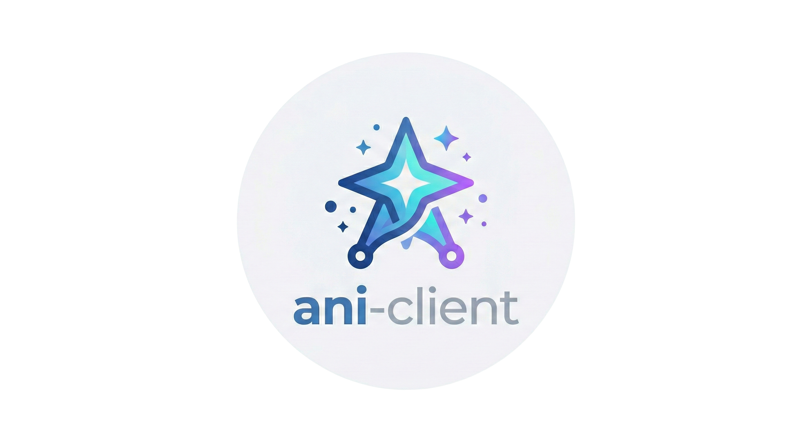

# ani-client 


[](https://github.com/gonzyui/ani-client/actions/workflows/ci.yml)
[](https://www.npmjs.com/package/ani-client)
[](LICENSE)

> A simple, typed client to fetch anime, manga, character, staff and user data from [AniList](https://anilist.co).

✨ **Showcase**: [Check here](https://docs-aniclient.gonzyuidev.xyz/showcase) to see which projects use this package!

- **Zero dependencies** — uses the native `fetch` API
- **Universal** — Node.js ≥ 20, Bun, Deno and modern browsers
- **Dual format** — ships ESM + CJS with full TypeScript declarations
- **Reliable** — Built-in caching, Rate-limit protections with exponential backoff, automatic retries & request deduplication!

## 📖 Documentation

The full API reference, usage guide, and configuration examples are available on our official documentation website!

**[👉 View the full documentation here](https://gonzyuidev.xyz/docs/aniclient/)**

## Install

```bash
# npm
npm install ani-client

# pnpm
pnpm add ani-client

# yarn
yarn add ani-client

# bun
bun add ani-client
```

## Quick start

```ts
import { AniListClient, MediaType } from "ani-client";

const client = new AniListClient();

// Get an anime by ID
const cowboyBebop = await client.getMedia(1);
console.log(cowboyBebop.title.romaji); // "Cowboy Bebop"

// Search for anime
const results = await client.searchMedia({
  query: "Naruto",
  type: MediaType.ANIME,
  perPage: 5,
});
console.log(results.results.map((m) => m.title.english));
```

## Contributing

See [CONTRIBUTING.md](CONTRIBUTING.md) for development setup, coding standards, and how to submit changes.

## License

[MIT](LICENSE) © gonzyui
